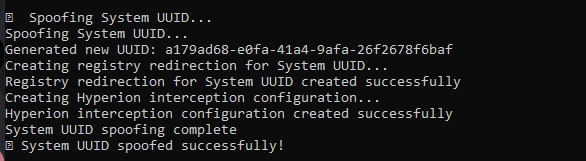
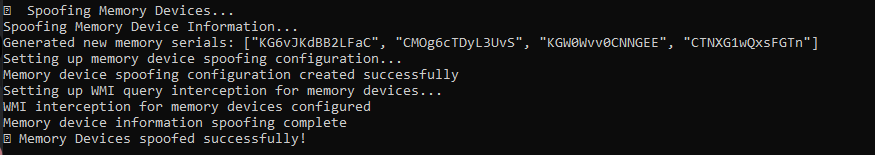
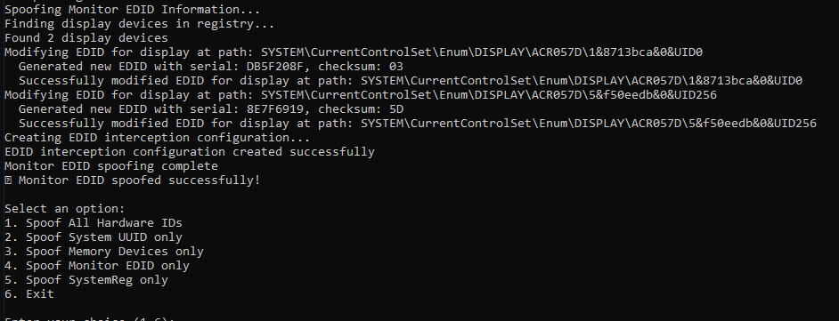
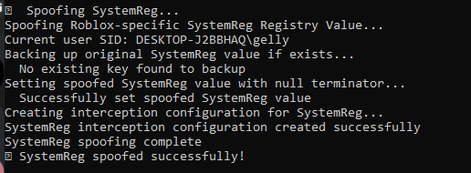

# Roblox HWID Spoofer

A hardware ID spoofer designed to bypass Roblox's Hyperion alt detection system.

## ⚠️ Disclaimer

This software is provided for educational purposes only. Using this software may violate Roblox's Terms of Service and could result in account bans or other penalties. Use at your own risk.

## Purpose

Roblox's Hyperion alt detection system collects hardware identifiers to detect and link alternate accounts. This tool spoofs those identifiers to reduce the likelihood of detection. This project demonstrates how hardware identifiers can be modified and the techniques used for hardware fingerprinting.

## Features

This HWID spoofer targets four specific hardware identifiers that Hyperion uses:

1. **System UUID** - Spoofs the SMBIOS System UUID by modifying the registry to provide a fake UUID
2. **Memory Device Information** - Creates fake memory device serial numbers to prevent device matching
3. **Monitor EDID Data** - Modifies the EDID (Extended Display Identification Data) for connected monitors
4. **Special SystemReg Registry Value** - Handles the Roblox-specific registry value with null terminator

## Requirements

- Windows 10/11
- Administrator privileges (required for registry modification)
- Rust programming environment (for building from source)

## Installation

### Pre-built Binary

1. Download the latest release from the [Releases](https://github.com/24rr/roblox-hwid/releases) page
2. Run the executable as Administrator

### Building from Source

1. Clone this repository
```
git clone https://github.com/24rr/roblox-hwid.git
cd roblox-hwid
```

2. Build the project
```
cargo build --release
```

3. Run the executable as Administrator
```
.\target\release\roblox-hwid-spoofer.exe
```

## Showcase

1. System UUID



2. Memory Devices



3. Monitor EDID



4. SystemReg



## Usage

1. Run the application as Administrator
2. Select one of the following options:
   - Spoof All Hardware IDs (recommended)
   - Spoof System UUID only
   - Spoof Memory Devices only
   - Spoof Monitor EDID only
   - Spoof SystemReg only
3. The application will modify the necessary registry keys and create configuration for spoofing
4. Launch Roblox after spoofing is complete

## How It Works

### System UUID Spoofing

Generates a random UUID and creates registry keys to intercept SMBIOS UUID queries.

### Memory Device Spoofing

Creates fake memory device information with randomized serial numbers and stores them in the registry to be provided during WMI queries.

### Monitor EDID Spoofing

Modifies the EDID data stored in the registry for each connected monitor, focusing on the serial number portion while maintaining valid checksum values.

### SystemReg Spoofing

Handles the special registry value with null terminator that Roblox uses as part of its fingerprinting system.

## Technical Details

The spoofer works by creating registry keys that intercept Hyperion's attempts to query hardware information. It sets up:

1. Registry redirection for hardware identifiers
2. Interception configurations to handle WMI queries
3. Special handling for null-terminated registry values
4. Proper checksum calculation for data structures like EDID

## Contributing

Contributions are welcome! Please feel free to submit a Pull Request.

## License

This project is licensed under the MIT License - see the LICENSE file for details. 